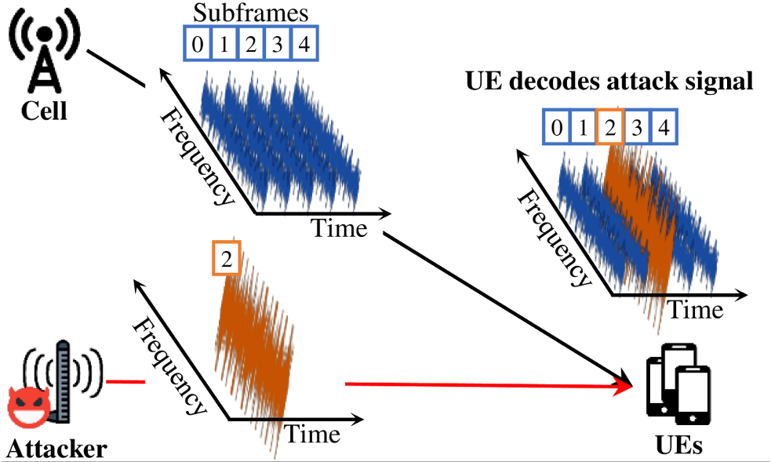
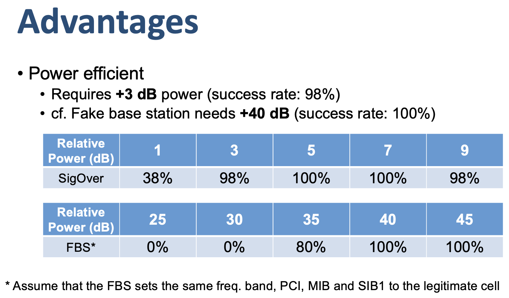

Description
========

SigOver (signal overshadowing attack) exploits the fundamental weakness of broadcast messages in LTE and modifies a transmitted signal over the air. By using this tool, you can inject a manipulated broadcast signal into UEs without employing an FBS. 

**Use responsively**
>Overshadowing a LTE signal on licensed frequencies might be illegal in your country.
(Each country has unique regulations regarding the wireless transmission of signals and these regulations are drafted, implemented, and modified by each country's government, not by an international organization.)
>
>Also, it may affect other users not to receive legitimate signals. 

## What SigOver?
SigOver is a signal injection attack that exploits the fundamental weakness of physical layer in Long-Term Evolution (LTE). 
Since LTE communication is based on an open medium, a legitimate signal can potentially be counterfeited by a malicious signal. In addition, although most LTE signaling messages are protected from modification using cryptographic primitives, broadcast messages in LTE have never been integrity protected. 

<p align="center">

 </p>

This attack has several advantages and differences when compared with existing attacks using a fake base station. For example, with a 3 dB power difference from a legitimate signal, the SigOver demonstrated a 98% success rate when compared with the 80% success rate of attacks achieved using a fake base station, even with a 35 dB power difference. Given that the SigOver is a novel primitive attack, it yields five new attack scenarios and implications. 

<p align="center">

 </p>
 
Please refer to [our
paper](https://syssec.kaist.ac.kr/pub/2019/sec19-yang-hojoon.pdf) for more details. 
If you are also interested in overshadowing unicast messages in LTE, please refer to our [36C3 talk](https://media.ccc.de/v/36c3-10801-sigover_alpha). 


SigOver Manual Common
========

SigOver is implemented on the top of the [srsLTE](https://github.com/srsran/srsRAN). 
So it requires the same setup as when executing the srsLTE. 
In addition, due to the tight frequency requirements in LTE, we highly recommend you to use a USRP X310 combined with a GPS disciplined oscillator (GPSDO). 
And prepare the attack message by using [sigover_gen_sample](https://github.com/SysSec-KAIST/sigover_gen_sample). 

**Prerequisite**
 - USRP X310 with GPSDO (TCXO or LCXO), (+It’s better to have GPS antenna)
 - Ubuntu PC (we used 16.04) that can execute the srsLTE. 
 - Configuration of target eNB. (e.g. by using pdsch_ue of srsLTE)
 - Attack message (i.e. IMSI paging message). 

**Overall Procedure**
1. Repository “sigover_gen_sample” is for building a subframe with an IMSI paging message.
2. Get configuration of target eNB which the victim UE is connected to. (PHICH Length, PHICH Resources, cyclic prefix, transmission mode, number of ports, number of PRB, PCI)
3. Go to the “lib/test/common/gen_sample.cc” and change cell configurations on with target eNB’s. 
4. Build the project. 
5. By executing build/lib/test/common/gen_sample on “sigover_gen_sample”, you can get a file named “output.” 
6. Repository “sigover_injector” is for injecting an IMSI paging message at specific timing and frequency.
7. Build the project.
8. Copy “output” file to sigover_injector/build/lib/examples
9. Using build/lib/examples/pdsch_enodeb, you can inject the IMSI paging message on the air. 

INJECTOR
========

**Building**
```
mkdir build
cd build
cmake ..
make
```

**Executing**
```
cd lib/examples
cp {where the file "output" from "sigover_gen_sample" is located, e.g. */sigover_gen_sample/build}/output .

sudo ./pdsch_enodeb -f @1 -a @2 -p @3 -g @4 -D @5 -i @6
@1: TX frequency (target cell's DL frequency)
@2: SDR option
@3: number of prb
@4: TX gain
@5: Attack mode. sigover_gen_sample generates IMSI paging message. 0 is for IMSI paging.
@6: Input file name. Default is "output"

(example)
sudo ./pdsch_enodeb -f 2120e6 -a clock=gpsdo,type=x300 -p 100 -g 30 -D 0 -i "output"

```

# Credits
We sincerely appreciate the [SRS team](https://www.srs.io) for making their great software available :)


# BibTex
Please refer to [our
paper](https://syssec.kaist.ac.kr/pub/2019/sec19-yang-hojoon.pdf) for more details. 
```bibtex
@article{yaang:2019:sigover,
  author = {Yang, Hojoon and Bae, Sangwook and Son, Mincheol and Kim, Hongil and Kim, Song Min and Kim, Yongdae},
  title = {Hiding in plain signal: Physical signal overshadowing attack on {LTE}},
  booktitle = {28th USENIX Security Symposium (USENIX Security 19)},
  year = 2019
}
```
